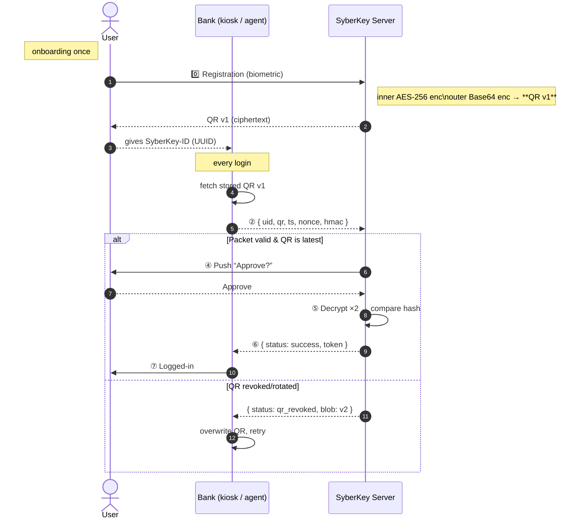

# SyberKey ↔︎ Bank Demo

> **Interactive prototype** that mirrors the patented SyberKey “Identity‑as‑a‑Service” flow.  
> Experience double‑encrypted QR credentials, signed login packets, out‑of‑band push approval, server‑side biometric matching, and QR‑rotation – all from one browser tab.

---

## 1 · What the demo shows

| Patent concept | Where you’ll see it on‑screen |
|----------------|--------------------------------|
| **Biometric capture** → QR generation | Registration banner (**0️⃣ Registered credentials**) simulates fingerprint capture (`fingerprint‑v1`). |
| **Double (triple) encryption** | `syber_core.double_encrypt()` → inner **AES‑like** layer, outer **Base64**. *(Add RSA‑OAEP for a 3rd layer in production.)* |
| **Portable QR token** | Displayed as **Active QR · v1** image; you can scan it to verify it’s opaque. |
| **Bank stores ciphertext only** | `Bank.store_qr()` keeps `blob` + `version`; never raw biometrics. |
| **Signed login packet** | After clicking **“Send login request”** the JSON appears verbatim (step ②). |
| **Signature & freshness checks** | Step ③ banner lists HMAC‑valid ✓ and timestamp‑fresh ✓. |
| **Out‑of‑band push approval** | Radio buttons **Approve / Deny** replicate the second‑device tap (step ④). |
| **Server‑side decrypt & match** | Step ⑤ banner → decrypt inner & outer layers, SHA‑256 compare. |
| **JWT‑like success token** | Returned to Bank on approval (step ⑥ / ⑦). |
| **QR rotation** | If SyberKey rotates to **v2**, the next login shows “QR revoked” → Bank pulls v2 and retries automatically. |

> **Crypto disclaimer** – encryption is illustrative only.  

---

## 3 · End‑to‑end flow



```
[1] User tells Bank: “I want to log in”  
    → Provides their SyberKey ID (e.g., phone number or short code)

[2] Bank App (used by agent/kiosk):
    → Looks up the stored QR code for this user
    → Sends to SyberKey Auth Server:
         {
           user_id: "abc123",
           qr_code: "<doubly-encrypted-data>",
           timestamp: "2025-06-24T20:00",
           nonce: "random123",
           signature: BankSignature(...)
         }

[3] SyberKey receives the request
    → Validates that it came from a trusted Bank (via signature)
    → Sends a push notification to user's phone/watch:
       “Do you approve login to XYZ Bank?”

[4] User sees this in SyberKey app
    → Taps "Approve"

[5] SyberKey decrypts QR code:
    → Inner + outer decryption
    → Matches biometric with stored template

[6] If match is successful:
    → SyberKey sends: `{ status: "success", user_token: <signed_JWT> }` back to Bank

[7] Bank App:
    → Trusts SyberKey's response
    → Logs user in
```
