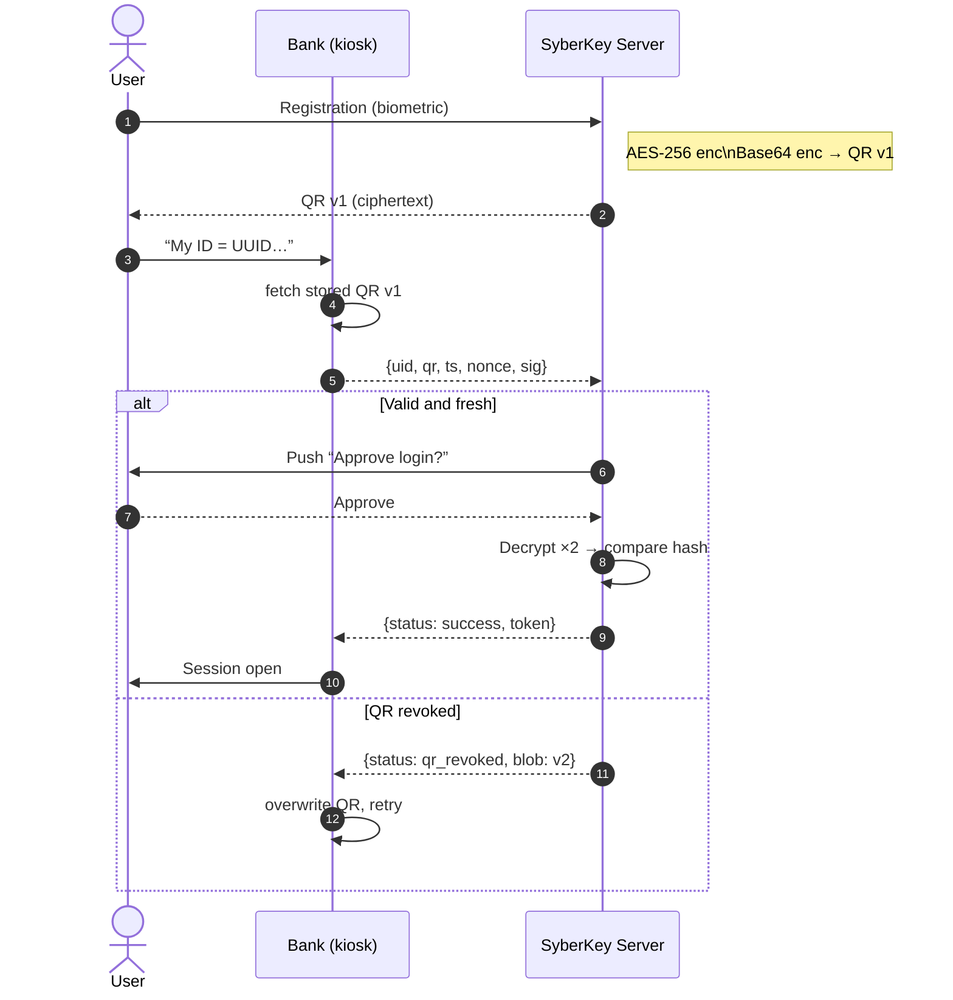

# SyberKey ↔︎ Bank Demo (Streamlit)

> **Interactive prototype** that mirrors the patented SyberKey Identity‑as‑a‑Service flow:  
> double‑encrypted QR credentials, signed login packets, push approval, server‑side biometric match, and QR rotation.

---

## 1 · What the demo shows

| Patent concept | Where you’ll see it in the web app |
|----------------|------------------------------------|
| **Biometric capture** → QR generation | Registration banner (“0️⃣ Registered credentials”) simulates fingerprint capture (`fingerprint‑v1`). |
| **Double (triple) encryption** | `syber_core.double_encrypt()` → inner **AES‑like** layer, outer **Base64**. *(Add RSA‑OAEP for a 3rd layer in production.)* |
| **Portable QR token** | Rendered as **Active QR · v1** image. |
| **Bank stores ciphertext only** | `Bank.store_qr()` keeps `blob` + `version` – never raw biometrics. |
| **Signed login packet** | After clicking **“Send login request”** the JSON is printed exactly as step ②. |
| **Signature & freshness checks** | Step ③ banner lists HMAC‑valid ✓ · timestamp‑fresh ✓. |
| **Out‑of‑band push approval** | Radio buttons **Approve / Deny** (step ④). |
| **Server‑side decrypt & match** | Step ⑤ banner → inner decrypt, outer decrypt, SHA‑256 compare. |
| **JWT‑like success token** | Returned to Bank on approval (step ⑥ / ⑦). |
| **QR rotation** | If SyberKey rotates to **v2**, next login shows “QR revoked” → Bank auto‑fetches v2 and retries. |

> **Crypto note** – encryption here is illustrative only.  
> Swap the toy “AES” with AES‑256‑GCM + RSA‑OAEP to meet the patent's production spec.

---

## 2 · Component map

```
syber_core.py      # business logic (no Streamlit)
│
├─ class SyberKey  # IdP; owns templates & decryption key
│   ├─ enroll()              # capture bio → QR vN
│   ├─ rotate_qr()           # issue vN+1, revoke vN
│   └─ handle_login()        # steps ③‑⑥
│
└─ class Bank      # relying party / kiosk
    ├─ store_qr()            # persist opaque blob
    └─ build_packet()        # produce signed JSON (step ②)

app.py             # Streamlit UI
0️⃣ show UUID & QR
1️⃣ input ID              → 2️⃣ send packet
3️⃣‑4️⃣ push approval      → 5️⃣ decrypt & match
6️⃣‑7️⃣ show success / rotation
```

---

## 3 · End‑to‑end flow (Mermaid)



---

## 4 · Run locally

```bash
git clone https://github.com/your-org/syber-demo
cd syber-demo
python -m venv venv && source venv/bin/activate
pip install -r requirements.txt
streamlit run app.py
```

Open **http://localhost:8501** and follow the numbered banners.

---

## 5 · One‑click deploy on Streamlit Cloud

1. Push the repo to GitHub.  
2. Visit <https://share.streamlit.io> → **New app**.  
3. Select repo / branch / `app.py` → **Deploy**.  

You’ll get a public HTTPS link that wakes in ~10 s and stays active while users interact.

---

## 6 · Production‑hardening checklist

| Gap in demo | Remedy in real system |
|-------------|-----------------------|
| Toy crypto (`_toy_aes_enc`, Base64) | Use **AES‑256‑GCM** for the inner layer, wrap with **RSA‑OAEP** or **ECIES** for outer layer, optionally a third envelope for the “triple encryption” claim. |
| Shared HMAC per bank | Switch to mutual‑TLS or signed JWT assertions from the Bank. |
| 30 s timestamp window | Tune to ≤ 10 s; add nonce replay cache. |
| Push‑fatigue risk | Include terminal/branch context in push screen and require device‑local biometric before “Approve”. |
| Raw template storage | Encrypt or hash templates at rest in HSM / KMS; purge raw biometrics after QR issuance. |

---

**Enjoy the demo!**  
It tracks every patented step from biometric capture through QR rotation — now clickable via a single URL.
