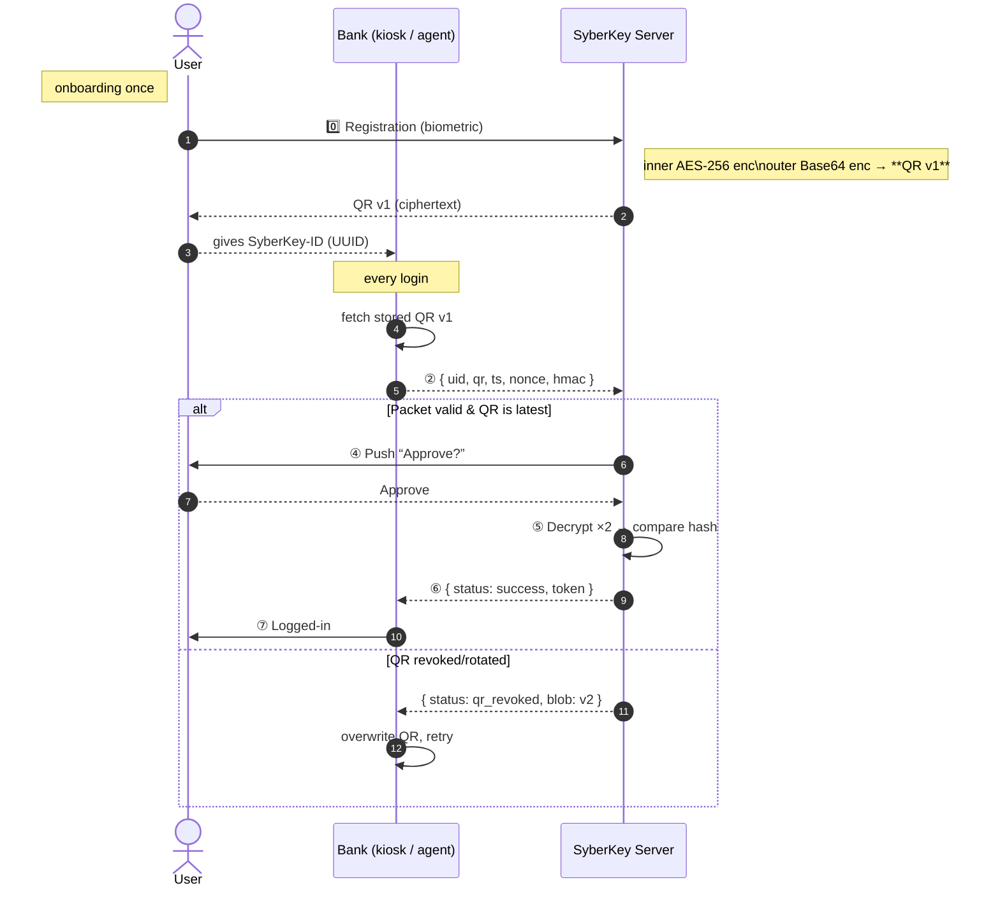

# SyberKey ↔︎ Bank Demo

> **Interactive prototype** that mirrors the patented SyberKey “Identity‑as‑a‑Service” flow.  
> Experience double‑encrypted QR credentials, signed login packets, out‑of‑band push approval, server‑side biometric matching, and QR‑rotation – all from one browser tab.

---

## 1 · What the demo shows

| Patent concept | Where you’ll see it on‑screen |
|----------------|--------------------------------|
| **Biometric capture** → QR generation | Registration banner (**0️⃣ Registered credentials**) simulates fingerprint capture (`fingerprint‑v1`). |
| **Double (triple) encryption** | `syber_core.double_encrypt()` → inner **AES‑like** layer, outer **Base64**. *(Add RSA‑OAEP for a 3rd layer in production.)* |
| **Portable QR token** | Displayed as **Active QR · v1** image; you can scan it to verify it’s opaque. |
| **Bank stores ciphertext only** | `Bank.store_qr()` keeps `blob` + `version`; never raw biometrics. |
| **Signed login packet** | After clicking **“Send login request”** the JSON appears verbatim (step ②). |
| **Signature & freshness checks** | Step ③ banner lists HMAC‑valid ✓ and timestamp‑fresh ✓. |
| **Out‑of‑band push approval** | Radio buttons **Approve / Deny** replicate the second‑device tap (step ④). |
| **Server‑side decrypt & match** | Step ⑤ banner → decrypt inner & outer layers, SHA‑256 compare. |
| **JWT‑like success token** | Returned to Bank on approval (step ⑥ / ⑦). |
| **QR rotation** | If SyberKey rotates to **v2**, the next login shows “QR revoked” → Bank pulls v2 and retries automatically. |

> **Crypto disclaimer** – encryption is illustrative only.  
> Swap the toy “reverse + Base64” with **AES‑256‑GCM** and **RSA‑OAEP** (or ECIES) to meet the patent’s production spec and achieve the “triple‑encryption” claim.

---

## 2 · Components in this demo

| Layer | File / Class | Role |
|-------|--------------|------|
| **Identity Provider** | `syber_core.SyberKey` | Holds hashed biometric templates, performs double‑decryption & matching, issues/rotates QR blobs, sends push approvals. |
| **Relying Party / Bank** | `syber_core.Bank` | Stores only opaque QR blobs (+ version), builds the signed JSON packet for each login. |
| **Web UI** | `app.py` (Streamlit) | Pretends to be both the kiosk and the user’s phone: • accepts SyberKey‑ID • prints the signed packet • shows push approval controls • displays success/failure & token. |
| **Toy cryptography** | functions in `syber_core.py` | `_toy_aes_enc` (reverse bytes), `double_encrypt`, HMAC‑SHA256 – easy to audit, easy to swap for real libs later. |

---

## 3 · End‑to‑end flow



---

## 4 · Production‑hardening checklist

| Gap in demo | Remedy in a real build |
|-------------|------------------------|
| **Toy crypto** (`_toy_aes_enc`, Base64) | Use **AES‑256‑GCM** for the inner layer; wrap with **RSA‑OAEP** (or ECIES) as outer layer; optional 3rd envelope for “triple encryption”. |
| Shared HMAC per bank | Replace with mutual‑TLS or signed JWT assertions from the Bank. |
| 30 s timestamp window | Tune to ≤ 10 s; add nonce‑replay cache or Redis set. |
| Push‑fatigue risk | Include terminal/branch context in push UI; require device‑local biometric before “Approve”. |
| Raw template storage | Encrypt or hash templates at rest in HSM / KMS; purge raw biometrics after QR issuance. |

---

### How to run locally

```bash
git clone https://github.com/your‑org/syber‑demo
cd syber‑demo
python -m venv venv && source venv/bin/activate
pip install -r requirements.txt
streamlit run app.py
```
Navigate to **http://localhost:8501** and follow the numbered banners.

### One‑click deploy (Streamlit Cloud)

1. Push the repo to GitHub.  
2. Go to <https://share.streamlit.io>. Click **New app**.  
3. Select repo / branch / `app.py` → **Deploy**.  

You’ll receive a public HTTPS URL – share it with stakeholders; no install required.

---

_*This demo is intentionally lightweight to emphasise the patented control points. Replace the placeholder crypto with production‑grade libraries before real deployments.*_
